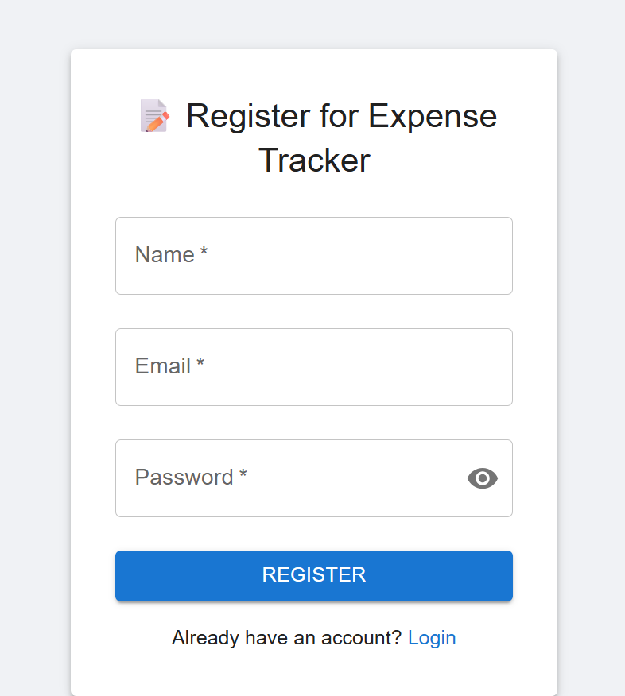
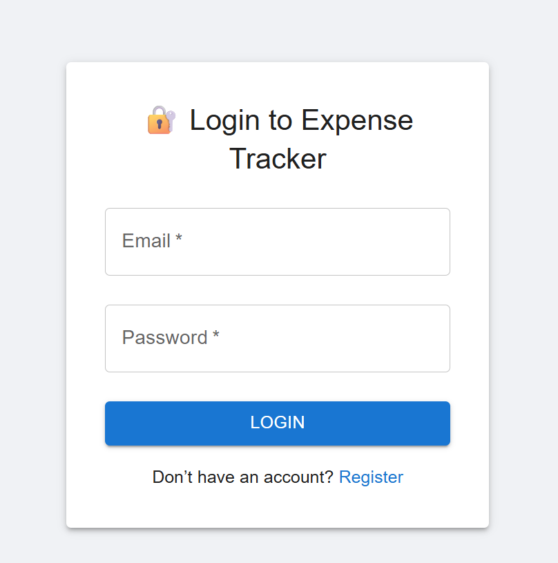
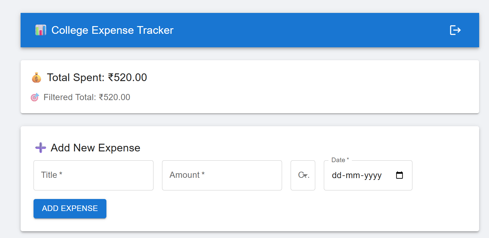
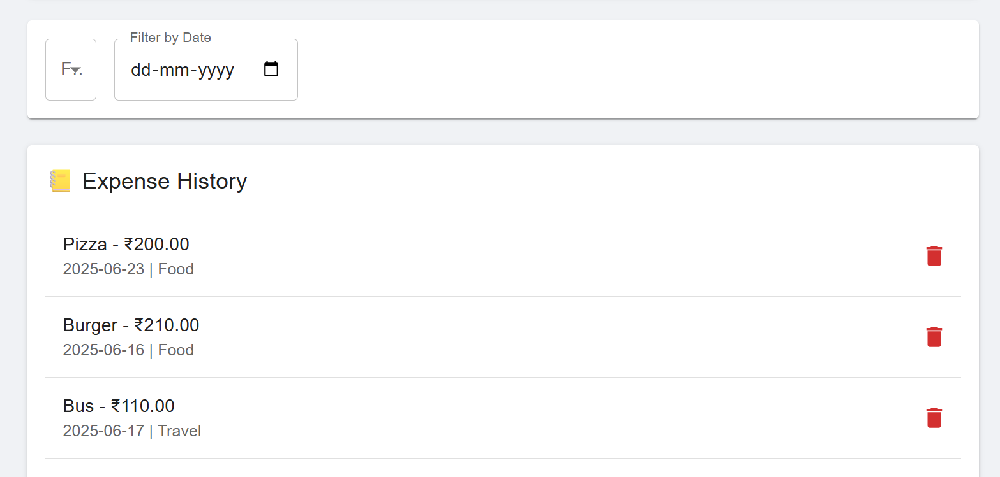

# SpendSage 💸

**SpendSage** is a lightweight and user-friendly **College Expense Tracker** built using React, PHP, and MySQL. It helps students monitor and filter their daily expenses with ease, ensuring better financial awareness and discipline.

## 🚀 Features

- 📋 Register and login system
- ➕ Add, filter, and delete expenses
- 💰 Total & filtered summaries
- 📆 Date and category filters
- 🔐 User-specific data management
- 🎨 Styled using Material UI

---

## 📁 Project Structure

```bash
college-expense-tracker/
│
├── backend/
│   ├── register.php
│   ├── login.php
│   ├── addExpense.php
│   ├── getExpenses.php
│   ├── deleteExpense.php
│
├── frontend/
│   ├── public/
│   │   └── index.html
│   ├── src/
│   │   ├── App.js
│   │   ├── components/
│   │   │   ├── ExpenseTracker.js
│   │   │   ├── LoginPage.js
│   │   │   ├── RegisterPage.js
│   │   └── index.js
│   └── package.json
│
└── README.md
```

---

### 🔷 Frontend (React)
- Built using **ReactJS** and **Material UI** for modern, responsive UI.
- Features include:
  - User registration and login (with hashed passwords)
  - Add / view / filter / delete expenses
  - Total and filtered expense summary
  - Logout and user session management

### 🔷 Backend (PHP + MySQL)
- Built using **vanilla PHP** APIs hosted via **XAMPP**
- Features include:
  - `register.php`: Handles user registration with email uniqueness check
  - `login.php`: Validates credentials and returns user info
  - `addExpense.php`: Adds new expense tied to logged-in user
  - `getExpenses.php`: Retrieves all expenses for the user (with optional filters)
  - `deleteExpense.php`: Deletes specific expense entry

### 🔷 Database Structure

**Database name**: `expense_tracker`

#### `users` table:
| Column    | Type         |
|-----------|--------------|
| id        | int (PK, AI) |
| name      | varchar(100) |
| email     | varchar(100) UNIQUE |
| password  | varchar(255) |

#### `expenses` table:
| Column        | Type          |
|---------------|---------------|
| id            | int (PK, AI)  |
| user_id       | int (FK)      |
| title         | varchar(100)  |
| amount        | float         |
| category      | varchar(50)   |
| expense_date  | date          |

---

## 🚀 Getting Started

### ✅ Prerequisites

- Node.js and npm installed
- XAMPP with Apache and MySQL
- Git (optional, for version control)

### 🛠️ Setup Instructions

1. **Clone the repository**:
   ```bash
   git clone https://github.com/yourusername/spendsage.git
   cd spendsage
   ```

2. **Frontend setup**:
   ```bash
   cd frontend
   npm install
   npm start
   ```

3. **Backend setup (XAMPP)**:
   - Open XAMPP and start **Apache** and **MySQL**
   - Place your backend PHP files inside:
     ```
     C:/xampp/htdocs/college-expense-tracker/backend/
     ```

4. **Create the database**:
   - Visit `http://localhost/phpmyadmin`
   - Create a new database `expense_tracker`
   - Run the following SQL to create the tables:

   ```sql
   CREATE TABLE users (
     id INT AUTO_INCREMENT PRIMARY KEY,
     name VARCHAR(100),
     email VARCHAR(100) UNIQUE,
     password VARCHAR(255)
   );

   CREATE TABLE expenses (
     id INT AUTO_INCREMENT PRIMARY KEY,
     user_id INT,
     title VARCHAR(100),
     amount FLOAT,
     category VARCHAR(50),
     expense_date DATE,
     FOREIGN KEY (user_id) REFERENCES users(id) ON DELETE CASCADE
   );
   ```

5. **Done!** Go to:
   ```
   http://localhost:3000
   ```
   to use the app.

---

## 📸 Screenshots

### 📝 Register Page


### 🔐 Login Page


### 💼 Expense Tracker Dashboard - Summary View


### 💼 Expense Tracker Dashboard - Add Expense View



## 📌 Features to Add (Suggestions)
- Charts for visual expense analysis
- Export to PDF/CSV
- Dark mode
- Google login integration

## 👨‍💻 Made With Love By
**Aditya Prakash** 💙

